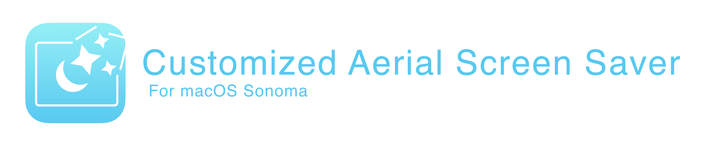
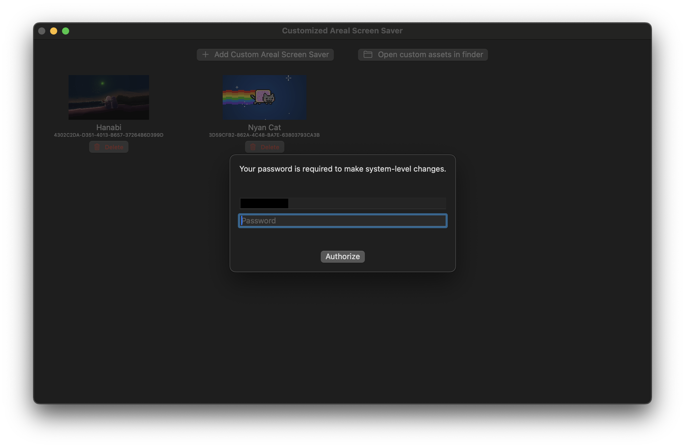
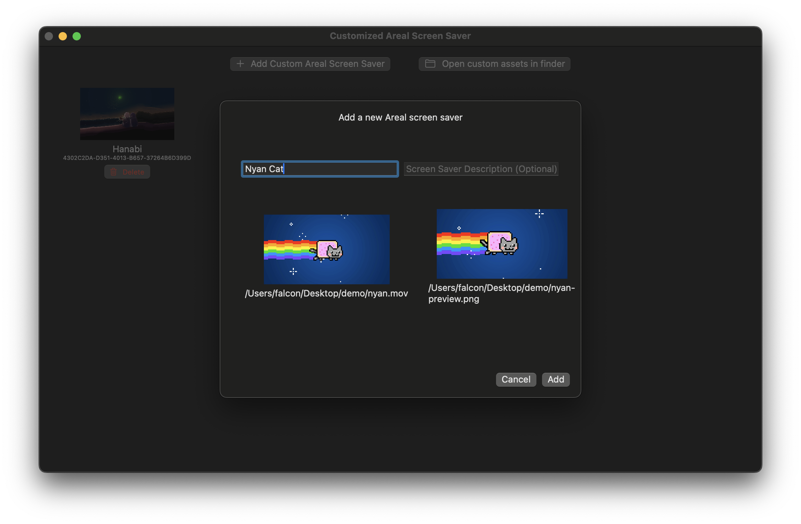
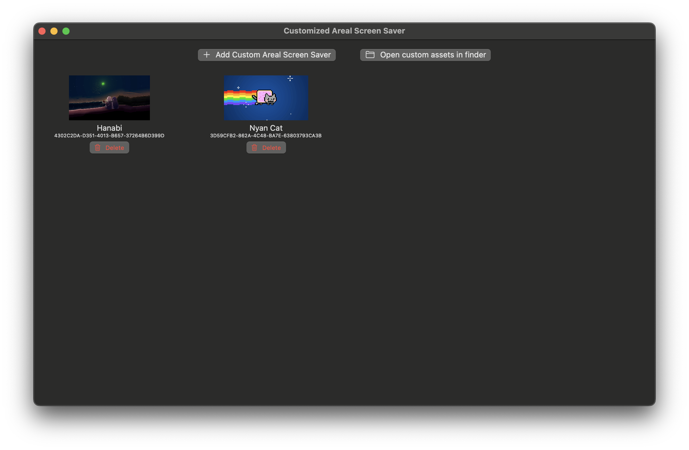
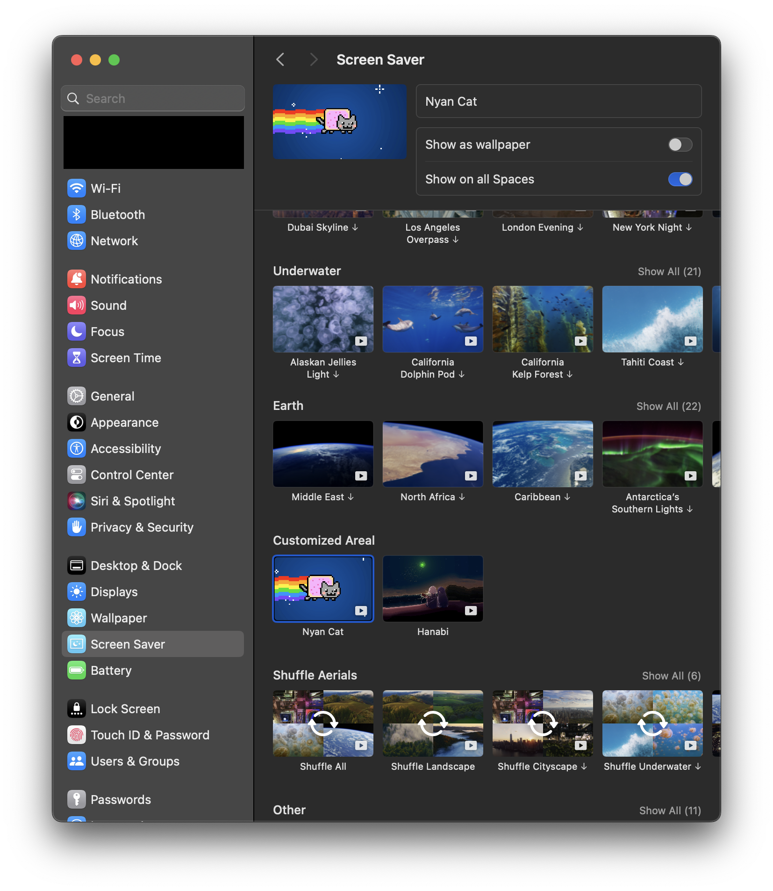
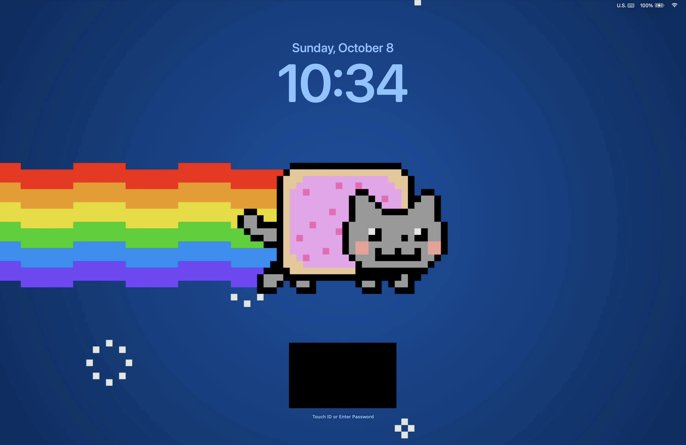

# Customized Aerial Screen Saver

  

## Important Notice
> [!IMPORTANT]
> The latest stable release is currently not working on macOS 26 Tahoe.
> 
> However, a [beta branch](https://github.com/FalconLee1011/Customized-Aerial-Screen-Saver/tree/main) and [beta version has been released](https://github.com/FalconLee1011/Customized-Aerial-Screen-Saver/releases/tag/v2.0.0beta) that is providing support macOS 26 Tahoe! Unleash supercharged customization!

## Overview
Since [macOS 14.0 Sonoma](https://www.apple.com/macos/sonoma/), Apple has brought Aerial Screen Savers from tvOS to macOS, which provides stunning live screen savers when the device is locked.

However, it does not provide the ability to customize, so, here's a solution to that! With Customized Aerial Screen Saver, you can add whatever the video you want for Aerial Screen Saver!

## Usage
You'll need
- A .mov video
- A .png image for video preview

### Recommended Video Format
| Attribute | Requirements |
|:-|:-| 
| Length | At least 15 seconds |
| Audio Track | Prefer no audio track |
| FPS (Frames Per Second) | At 60 FPS |
| Aspect Ratio | 16:9 |
| Resolution | At least 1920x1080 |
| Video Format | Must be .mov |

Upon launch the app, you must enter your password in order to modify system resources.

And click "Add Custom Aerial Screen Saver", enter a name for the screen saver, then drag your video and preview image, click "Add" to add the customized screen saver

You can view and delete existing Aerial Screen Savers in the app.

A section "Customized Area" should appear in Screen Saver in System Settings.

Select it and enjoy!

## How does it work?

Given a password prompt exists in the app, regardless the app is open-sourced, a full disclosure is better than anything that you can do to earn everyone's trust, right?

The work behind the app is simple
All the aerial screen saver assets are stored under `/Library/Application Support/com.apple.idleassetsd/`

Where videos are under `/Library/Application Support/com.apple.idleassetsd/Customer/4KSDR240FPS`

and preview images are under `/Library/Application Support/com.apple.idleassetsd/snapshots`

And there goes a JSON 
`/Library/Application Support/com.apple.idleassetsd/Customer/entries.json` which stores all aerial screen saver's info

By modifying the JSON, you can add whatever you want as an Aerial Screen saver, that's why you'll need to provide your password in order to modify these files.

## Community is everything!
If you find this project useful and would like to support its development, you can
  - Create an issue https://github.com/FalconLee1011/Customized-Aerial-Screen-Saver/issues 
  - Create an pull request https://github.com/FalconLee1011/Customized-Aerial-Screen-Saver/pulls
  - Star this project
  - Spread happiness! Share the app!

If you really love this app or me, you can consider

